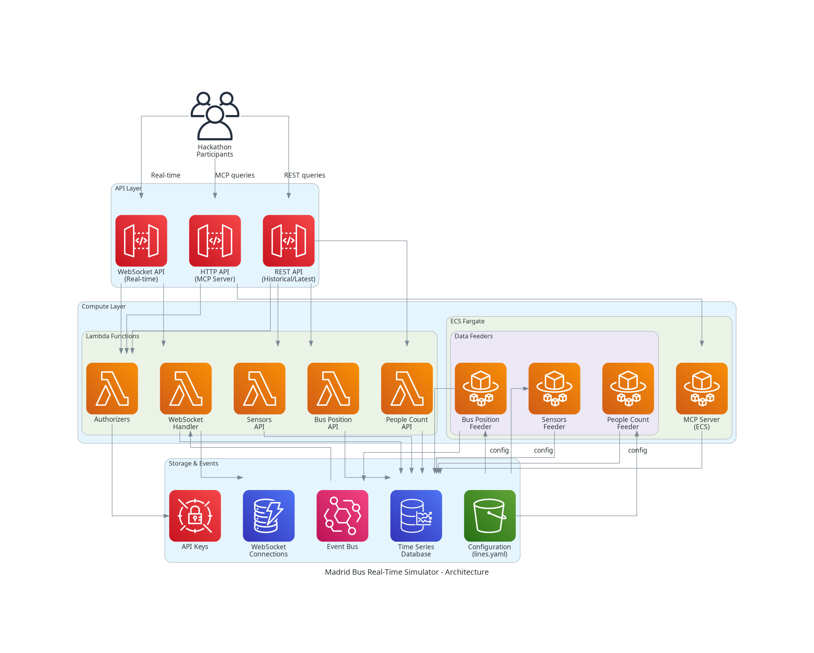
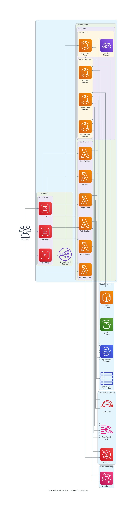
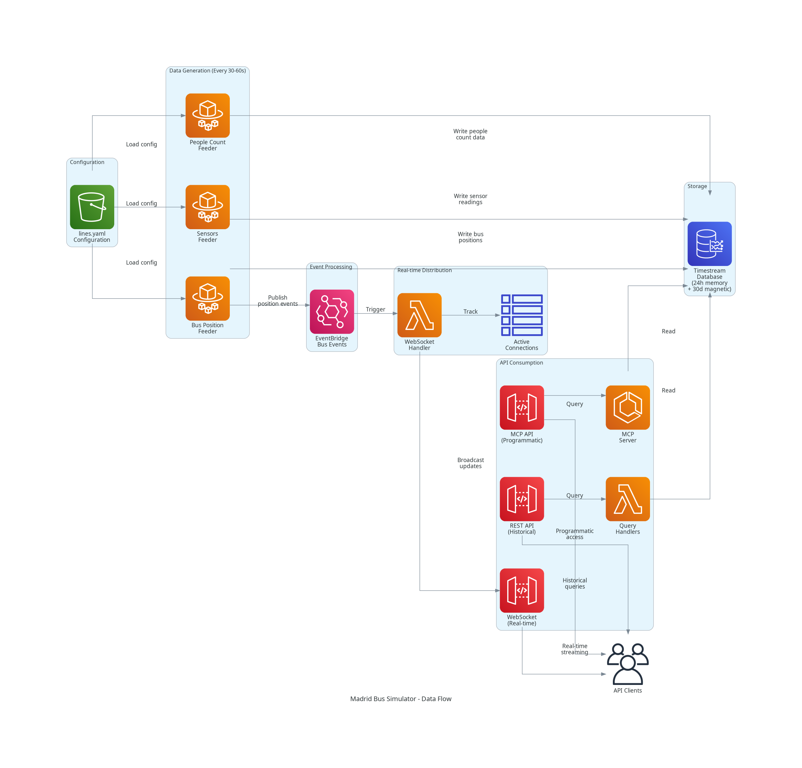
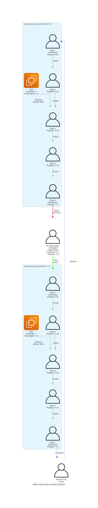

# Madrid Bus Real-Time Simulator

A cloud-native system that generates and serves temporally consistent simulated data for Madrid Centro's EMT bus system.

## Overview

The Madrid Bus Real-Time Simulator is designed for hackathons and educational purposes, providing realistic bus operation data through REST and WebSocket APIs. The system continuously generates data for bus positions, passenger counts, and sensor readings, storing it in AWS Timestream for historical queries.

## Architecture

### High-Level Overview



The system follows a producer-consumer pattern with three main layers:

1. **Data Generation Layer (Fargate)**: Three feeder services continuously generate realistic bus operation data
2. **Event & Storage Layer**: AWS Timestream stores time series data, EventBridge handles real-time events
3. **API Layer (Lambda + API Gateway)**: REST and WebSocket APIs serve data to clients

### Detailed Architecture



**Key Components:**

- **API Gateway**: 
  - REST API with API key authentication for historical/latest queries
  - WebSocket API with custom authorizer for real-time updates
  
- **Lambda Functions**:
  - People Count API: Query passenger counts at bus stops
  - Sensors API: Query temperature, humidity, CO2, door status
  - Bus Position API: Query bus locations and passenger counts
  - WebSocket Handler: Manage real-time subscriptions and broadcasts
  - WebSocket Authorizer: Validate API keys for WebSocket connections

- **Fargate Services**:
  - People Count Feeder: Generates passenger arrival/departure data
  - Sensors Feeder: Generates environmental sensor readings
  - Bus Position Feeder: Simulates bus movement along routes

- **Storage**:
  - Timestream: Time series database (24h memory + 30d magnetic)
  - DynamoDB: WebSocket connection tracking
  - S3: Configuration storage (lines.yaml)

- **Event Processing**:
  - EventBridge: Routes real-time bus position events to WebSocket clients

### Data Flow



**Continuous Data Generation:**
1. Feeder services generate data every 30-60 seconds
2. Data is written to Timestream with automatic retention
3. Bus position updates trigger EventBridge events
4. Events are broadcast to subscribed WebSocket clients

**API Consumption:**
- REST APIs: Query latest or historical data with API key authentication
- WebSocket API: Subscribe to real-time updates for specific bus lines
- All APIs enforce rate limiting (50 req/sec, 10k req/day per key)

## Features

- **Real-time bus positions**: Track buses along their routes with GPS coordinates
- **Bidirectional routes**: Buses travel outbound and return on inbound routes with automatic direction changes at terminals
- **Passenger counts**: Monitor people waiting at stops and riding on buses
- **Sensor data**: Temperature, humidity, CO2 levels, and door status
- **Historical queries**: Access up to 30 days of historical data
- **WebSocket streaming**: Real-time position updates for subscribed bus lines
- **Daily patterns**: Realistic passenger flow based on time of day
- **Temporal consistency**: Coordinated updates across all data types

### Bidirectional Route System



The simulator implements realistic bidirectional bus routes:

- **Outbound (Direction = 0)**: Buses travel from first stop to last stop
- **Terminal Stop Behavior**: When reaching a terminal stop:
  - All passengers alight (get off)
  - New passengers board
  - Direction toggles (0 → 1 or 1 → 0)
  - Position resets to 0.0 for return journey
- **Inbound (Direction = 1)**: Buses travel the return route back to origin
- **Direction Consistency**: Direction value remains constant between terminal stops

This ensures realistic bus operations where buses complete round trips on their routes.

## Prerequisites

- AWS Account with appropriate permissions
- Terraform >= 1.0
- Podman (for building container images)
- Python 3.11+
- AWS CLI configured

## Quick Start

### 1. Clone the Repository

```bash
git clone <repository-url>
cd dataviz-bus-realtime
```

### 2. Build Container Images

```bash
make build-feeders
```

### 3. Deploy Infrastructure

```bash
# Initialize Terraform
make init

# Review deployment plan
make plan

# Deploy (builds images, pushes to ECR, applies Terraform, loads config)
make deploy AWS_REGION=eu-west-1
```

### 4. Get API Endpoints

```bash
cd terraform
terraform output http_api_endpoint
terraform output websocket_api_endpoint
```

### 5. Test the APIs

```bash
# Get latest people count at stop S001
curl "$(terraform output -raw http_api_endpoint)/people-count/S001?mode=latest"

# Get latest bus position
curl "$(terraform output -raw http_api_endpoint)/bus-position/B001?mode=latest"
```

## Configuration

### Bus Lines Configuration

Edit `data/lines.yaml` to configure bus lines, stops, and buses:

```yaml
lines:
  - line_id: "L1"
    name: "Plaza de Castilla - Atocha"
    stops:
      - stop_id: "S001"
        name: "Plaza de Castilla"
        latitude: 40.4657
        longitude: -3.6886
        is_terminal: true
        base_arrival_rate: 2.5  # people per minute
      - stop_id: "S002"
        name: "Paseo de la Castellana"
        latitude: 40.4500
        longitude: -3.6900
        is_terminal: false
        base_arrival_rate: 1.8
    buses:
      - bus_id: "B001"
        capacity: 80
        initial_position: 0.0
```

After modifying the configuration, reload it:

```bash
make load-config AWS_REGION=eu-west-1
```

## API Documentation

See [docs/API_DOCUMENTATION.md](docs/API_DOCUMENTATION.md) for complete API reference.

### Quick Examples

**REST API:**
```bash
# Latest people count
curl "{api-endpoint}/people-count/S001?mode=latest"

# Historical sensor data
curl "{api-endpoint}/sensors/bus/B001?timestamp=2026-02-22T10:00:00Z"

# All buses on a line
curl "{api-endpoint}/bus-position/line/L1?mode=latest"
```

**WebSocket API:**
```javascript
const ws = new WebSocket('wss://{websocket-endpoint}');
ws.onopen = () => {
  ws.send(JSON.stringify({
    action: 'subscribe',
    line_ids: ['L1', 'L2']
  }));
};
ws.onmessage = (event) => {
  console.log('Position update:', JSON.parse(event.data));
};
```

## Development

### Running Tests

```bash
# Install development dependencies
pip install -r requirements-dev.txt

# Run all tests
pytest tests/

# Run with coverage
pytest --cov=src tests/

# Run property-based tests
pytest tests/test_properties.py -v
```

### Building Lambda Packages

```bash
# Package all Lambda functions
make package-all-lambdas

# Package a specific Lambda
make package-lambda LAMBDA=people_count_api
```

### Local Development

```bash
# Build container images locally
make build-feeders

# Test image imports
./docker/test_images.sh
```

## Deployment Timeline

For hackathon preparation:

1. **Day -7**: Deploy infrastructure (`make deploy`)
2. **Day -7 to Day -2**: Feeders run continuously, accumulating 5 days of data
3. **Day -1**: Verify system readiness (`make verify`)
4. **Day -1**: Export and distribute API keys (`make export-keys`)
5. **Day 0**: Hackathon begins, system continues running

### Pre-Hackathon Verification

Before the hackathon, run the verification script to ensure everything is working:

```bash
# Run verification checks
make verify AWS_REGION=eu-west-1

# Run with verbose output
make verify AWS_REGION=eu-west-1 VERBOSE=true
```

The verification script checks:
- ✓ Timestream has at least 5 days of historical data
- ✓ All Fargate services are running
- ✓ REST API endpoints respond correctly
- ✓ API key authentication is enforced
- ✓ WebSocket connections work properly

See [docs/VERIFICATION_SCRIPT.md](docs/VERIFICATION_SCRIPT.md) for detailed documentation.

## Monitoring

### CloudWatch Dashboards

Monitor system health through CloudWatch:
- Feeder service metrics (CPU, memory, task count)
- API Gateway metrics (requests, latency, errors)
- Lambda metrics (invocations, duration, errors)
- Timestream metrics (write throughput, query latency)

### Logs

All services log to CloudWatch Logs:
- Lambda functions: `/aws/lambda/bus-simulator-*`
- Fargate services: `/ecs/*-feeder`

## Cost Estimation

Approximate monthly costs for 7-day operation (5 days pre-hackathon + 2 days hackathon):

- API Gateway: $10-20
- Lambda: $5-10
- Timestream: $50-100
- Fargate: $30-50
- EventBridge: $5-10
- Amazon Location: $5

**Total: ~$105-195 for 7 days**

## Cleanup

To destroy all infrastructure:

```bash
make destroy AWS_REGION=eu-west-1
```

## Troubleshooting

### Feeder Services Not Starting

Check ECS service status:
```bash
aws ecs describe-services \
  --cluster bus-simulator-cluster \
  --services people-count-feeder sensors-feeder bus-position-feeder \
  --region eu-west-1
```

Check CloudWatch logs:
```bash
aws logs tail /ecs/people-count-feeder --follow --region eu-west-1
```

### API Returning 404

Verify Timestream has data:
```bash
aws timestream-query query \
  --query-string "SELECT COUNT(*) FROM bus_simulator.people_count" \
  --region eu-west-1
```

### Lambda Timeout Errors

Increase timeout in `terraform/modules/api-gateway/main.tf`:
```hcl
resource "aws_lambda_function" "people_count_api" {
  timeout = 60  # Increase from 30
  ...
}
```

## Contributing

Contributions are welcome! Please:

1. Fork the repository
2. Create a feature branch
3. Make your changes
4. Add tests for new functionality
5. Submit a pull request

## License

This project is licensed under the MIT License - see the [LICENSE](LICENSE) file for details.

## Acknowledgments

- Built for educational and hackathon purposes
- Uses AWS Timestream for time series data storage
- Implements property-based testing with Hypothesis
- Infrastructure as Code with Terraform

## Support

For issues or questions:
- Open an issue on GitHub
- Check the [API Documentation](docs/API_DOCUMENTATION.md)
- Review CloudWatch logs for debugging

## Project Structure

```
dataviz-bus-realtime/
├── data/                    # Configuration files
│   └── lines.yaml          # Bus lines configuration
├── docker/                  # Dockerfiles for Fargate services
├── docs/                    # Documentation
├── scripts/                 # Deployment and utility scripts
├── src/
│   ├── common/             # Shared utilities
│   ├── feeders/            # Data generation services
│   └── lambdas/            # API Lambda functions
├── terraform/              # Infrastructure as Code
│   └── modules/            # Terraform modules
├── tests/                  # Unit and property tests
├── Makefile               # Deployment automation
└── README.md              # This file
```

## Overview

This system simulates real-time bus operations through three APIs:
- **People Count API**: Query passenger counts at bus stops
- **Sensors API**: Access internal sensor data from buses and stops
- **Bus Position API**: Track real-time bus positions (REST + WebSocket)

## Architecture

The system uses AWS services:
- **Fargate**: Runs feeder services that generate simulated data
- **Timestream**: Stores time series data
- **API Gateway**: Exposes REST and WebSocket APIs
- **Lambda**: Processes API requests
- **EventBridge**: Routes real-time events
- **Amazon Location**: Manages bus routes

## Prerequisites

- AWS Account
- Terraform >= 1.0
- Docker >= 20.10
- Python >= 3.11
- Make

## Quick Start

1. Configure AWS credentials:
```bash
aws configure
```

2. Package Lambda functions:
```bash
make package-all-lambdas
```

3. Deploy the system:
```bash
make deploy
```

4. Destroy the system:
```bash
make destroy
```

## Development

### Packaging Lambda Functions

Package a specific Lambda function:
```bash
make package-lambda LAMBDA=people_count_api
```

Package all Lambda functions:
```bash
make package-all-lambdas
```

The ZIP files will be created in the `build/` directory. See [docs/LAMBDA_DEPLOYMENT.md](docs/LAMBDA_DEPLOYMENT.md) for detailed packaging and deployment instructions.

## Project Structure

```
dataviz-bus-realtime/
├── src/                    # Python source code
│   ├── feeders/           # Fargate feeder services
│   ├── lambdas/           # Lambda function handlers
│   └── common/            # Shared utilities and models
├── terraform/             # Infrastructure as code
├── docker/                # Dockerfiles for feeders
├── data/                  # Configuration data
├── scripts/               # Deployment and utility scripts
└── tests/                 # Unit and property-based tests
```

## Configuration

Edit `data/lines.yaml` to configure bus lines, stops, and buses.

## API Documentation

See [API.md](API.md) for detailed API documentation.

## License

See [LICENSE](LICENSE) for details.
